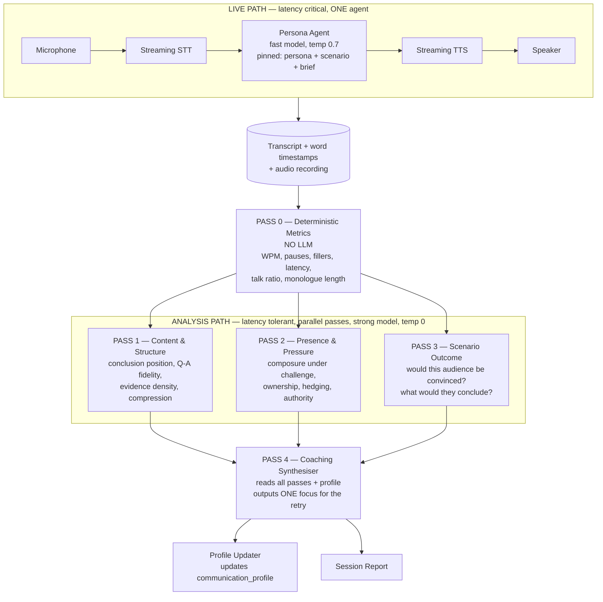
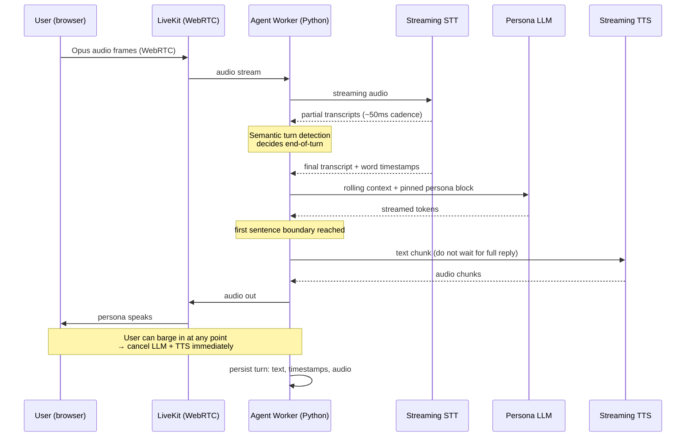
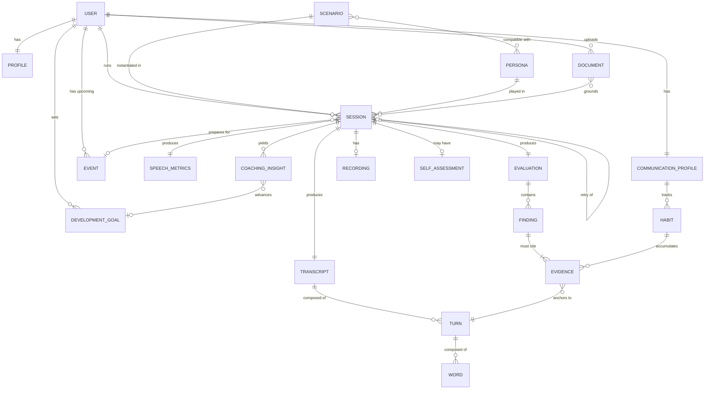
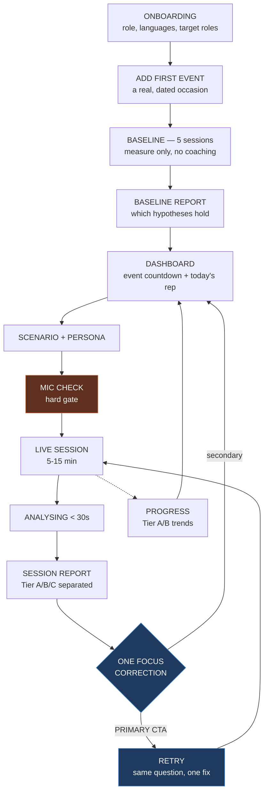
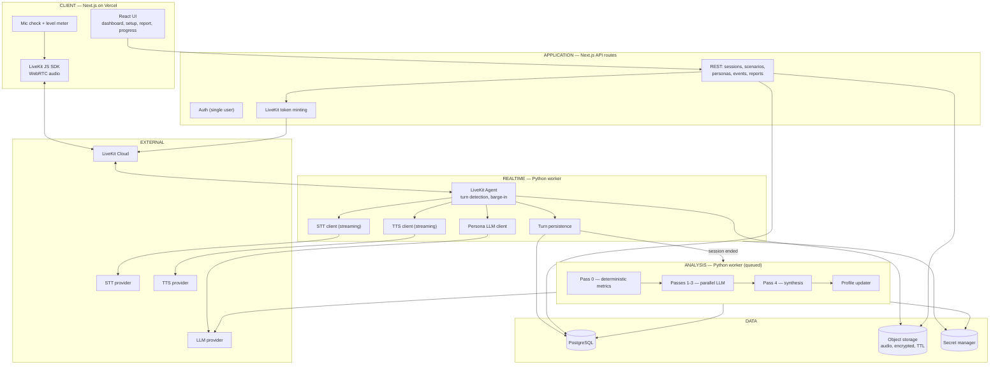

# Phase 0 — Analysis & Discovery Report
### AI Executive Communication Coach — working codename **"Mirror"**

**Prepared for:** Dr. Mohamed Etman
**Date:** 12 September 2026
**Status:** ANALYSIS ONLY — no production code written. Awaiting explicit `BUILD` instruction.
**Branch:** `claude/executive-coaching-analysis-qy5tnh`

---

## 0. Read this first — two things that change the plan

Before the report, two findings that materially affect what happens next.

### 0.1 The detailed product requirements were not attached to this session

Section 2 of your brief says *"Read the complete product requirements I provided."* No requirements document reached this session. What I actually have is:

1. Your **Master Context** document (background, positioning, working style, Makeen strategy)
2. The **differentiation list in Section 3** of your brief — Executive Mirror, seniority analysis, communication memory, CV+JD interview intelligence, boardroom simulation, healthcare executive scenarios, Saudi professional communication, Arabic/English bilingual, longitudinal development

I have **derived** the requirements in Section 4 from those two sources rather than stopping and waiting. Everything derived is labelled **[DERIVED]** and everything I assumed is labelled **[ASSUMPTION]**. Please correct the assumptions before we build — that correction is cheaper now than after Phase 1.

If a fuller requirements document exists, send it and I will re-run Sections 4, 5 and 12 against it. The architecture in Sections 7–10 is unlikely to change.

### 0.2 This repository is the wrong home for this product

The working directory `Equipment-dashboard` contains an unrelated **Streamlit dashboard for a Saudi equipment-import venture** (partner capital, inventory, sales — Arabic RTL). It shares nothing with a realtime voice coaching platform: no frontend framework, no Node project, no database, no auth, no tests, no CI.

**Recommendation:** build Mirror in a **new repository**. Full detail in Section 15.5. This report lives here because you directed the branch here; it is portable.

---

## 1. Product Analysis

### 1.1 What is actually being proposed

Stripped to its core, the proposal is:

> A private, voice-driven rehearsal environment where a senior executive practises high-stakes spoken situations against a realistic AI counterpart, receives evidence-backed feedback on both **delivery** and **executive judgment**, and can see how they are changing over months.

Three claims are bundled inside that sentence, and they carry very different risk:

| Claim | Difficulty | Defensibility | Verdict |
|---|---|---|---|
| "Realistic voice conversation with an AI persona" | Medium | **None** — commodity in 2026 | Necessary, not differentiating |
| "Feedback on delivery mechanics" | Low | **None** — Yoodli, and ten others | Necessary, not differentiating |
| "Feedback on executive judgment + longitudinal profile in a specific domain" | **High** | **Real** | This is the product |

This is the single most important conclusion in the report. **The voice stack is not the product.** In 2026 anyone can wire a streaming STT to an LLM to a TTS in a weekend. If Mirror is built as "Yoodli but ours," it fails — Yoodli has SOC-2, 300,000+ Toastmasters users, and enterprise distribution.

What is genuinely hard to copy is the **evaluation layer**: a rubric that knows what a CBAHI surveyor actually probes, what a GCC board chair actually punishes, what a hiring committee for a Group Quality Director actually listens for — plus a memory of how *this specific executive* has behaved over 40 sessions.

**Build the voice stack as cheap, boring plumbing. Spend the effort on the rubric, the scenario corpus, and the memory.**

### 1.2 What kind of product is this

| Dimension | Reading |
|---|---|
| Category | Deliberate-practice environment, not a "tool" |
| Core loop | Rehearse → Evidence → One correction → Rehearse again |
| Value moment | Not the report. The **second attempt that is measurably better than the first.** |
| Retention driver | Longitudinal profile + upcoming real events on the calendar |
| Failure mode | Becomes a novelty used 3 times, then abandoned |
| Honest business shape | v1 is a **personal instrument**. v2 is a **product** only if the rubric generalises beyond you. |

### 1.3 The uncomfortable question, answered honestly

*Will a busy Group Executive Director actually talk to a laptop for 10 minutes, three times a week?*

Only under one condition: **a real, dated, high-stakes event is coming.** Practice with no upcoming performance is a hobby, and hobbies lose to WhatsApp.

This has a direct design consequence, and it is the most important UX decision in this report:

> **Mirror must be organised around upcoming real events, not around a library of exercises.**

Not "here are 40 scenarios, pick one" — that is Yoodli's cold-start problem and it is why free-tier users churn. Instead: *"Your DBA defence is in 11 weeks. Your last three sessions showed you lead with methodology before conclusion. Here is today's 8-minute rep."*

You already have real, dated events: a DBA in its final stage with expected completion in 2026, active exploration of executive roles, Makeen investor conversations. **Those are the product's fuel.** Design for them.

---

## 2. Yoodli Benchmark

### 2.1 What Yoodli is, as of 2026

Positioning: *"AI speech coach + roleplay platform"* — practise presentations, sales pitches and difficult conversations with private real-time feedback. Enterprise credibility via Google, Sandler, Toastmasters (300,000+ members), SOC-2 Type 2, GDPR.

Pricing: Starter free (5 lifetime roleplays), Pro ~$8/mo annual (10 sessions/week), Advanced ~$20/mo annual (unlimited), Enterprise custom (SSO, SCIM, audit logs, manager dashboards).

Feature surface:
- **Roleplay** — generative back-and-forth, contextual follow-up questions, custom personas, scenario libraries, playbook upload
- **Analytics** — filler words, pacing (WPM), eye contact (video), word choice, repetition, non-inclusive language, vocabulary diversity, weak/hedging language, conciseness, timestamped
- **Progress** — progress curves per goal; users with a single attempt are excluded because progress cannot be measured
- **Loops** — continuous personalised learning; banner in dashboard, guided roleplay, post-practice feedback, learner can request focus on a specific skill
- **Admin** — analytics hub, per-goal effectiveness, manager visibility
- **Workflow** — open web app → start session → speak → stop → breakdown with timestamps within seconds

### 2.2 What Yoodli does well — and we should not try to beat

| Strength | Why it works | Our stance |
|---|---|---|
| **Time-to-first-value** | Session → analysed report in seconds | **Copy the standard.** Under 30s or it feels broken. |
| **Timestamped evidence** | Every claim jumps to the moment in the recording | **Copy exactly.** Non-negotiable credibility mechanic. |
| **Quantified, not vague** | "142 WPM", "17 fillers" beats "speak more clearly" | **Copy the discipline.** |
| **Progress curves per goal** | Makes improvement visible | **Copy — with a hard constraint** (see 8.4) |
| **Excluding single-attempt users from progress** | Intellectually honest | **Copy this honesty.** |
| **Enterprise trust posture** | SOC-2, GDPR, manager dashboards | Do not chase in v1. Irrelevant at N=1. |
| **Free tier as funnel** | Broad top-of-funnel | Not applicable — different business |

### 2.3 What is weak or limited — our openings

| Limitation (reported) | Why it matters to you | Opening |
|---|---|---|
| **Analyses *how* you speak, not the *quality or strategy* of what you say** | This is the whole game for an executive. A perfectly paced, filler-free wrong answer still loses the board. | **Primary wedge.** Content and judgment scoring. |
| **English-centric; limited multi-language depth** | You operate in Saudi Arabia across Arabic and English, often code-switching mid-sentence | **Second wedge** — but see 12.4 for staging |
| **Generic personas** | A "tough interviewer" is not a CBAHI surveyor or a Saudi board chair | **Third wedge** — domain-authentic personas |
| **Free tier too thin to build a baseline** (5 lifetime sessions; habits need 3–5 sessions to show a trend) | Confirms baseline is the real unit of value | Design baseline-first onboarding |
| **No document grounding** (no CV / JD / board pack ingestion) | Interview prep without the JD is generic | Phase 3 wedge |
| **Real-time analysis can lag; needs constant internet** | Minor | Not a wedge |
| **Eye contact via video** | High cost, unreliable estimate, low value for your cases | **Deliberately do not copy** (Section 8.5) |

### 2.4 What we should explicitly NOT copy

1. **Video / eye-contact analysis.** Large engineering and privacy cost; gaze estimation from webcam is noisy; your highest-value scenarios are audio-dominant or virtual. Skip.
2. **Non-inclusive language detection.** A US-market compliance feature. Wrong register for a GCC executive and a likely source of irritating false positives on healthcare and Arabic-influenced phrasing.
3. **Breadth of scenario library.** Yoodli wins on breadth. We must win on depth. Six excellent scenarios beat sixty shallow ones.
4. **Manager dashboards / admin analytics.** Irrelevant at N=1 and it drags in multi-tenancy, RBAC and audit logging.
5. **Freemium session caps as a design constraint.** Not a business here yet.
6. **Vocabulary-diversity scoring as a headline metric.** Type-token ratio is easy to compute and nearly meaningless for executive effectiveness. Executives should *repeat* their key message. Rewarding lexical variety actively teaches the wrong behaviour.

### 2.5 Benchmark summary

> Yoodli is a **broad delivery coach** for a **wide audience**. Mirror should be a **deep judgment coach** for a **narrow one**. Match Yoodli on session mechanics and evidence discipline; beat it on rubric depth, domain authenticity, bilingual capability and memory; ignore it entirely on breadth, video and enterprise administration.

---

## 3. Differentiation

### 3.1 Unique Value Proposition

> **Mirror is a private rehearsal room where a senior healthcare and business executive practises the specific conversations that decide their career — board defences, accreditation surveys, executive interviews, investor pitches — against counterparts that behave like the real thing, in Arabic and English, and receives evidence-backed feedback on judgment and presence, not just pacing and filler words.**
>
> **It remembers. Over months it builds a factual profile of how you actually communicate under pressure, and coaches the gap between that and the executive you are becoming.**

Short form: **"Yoodli tells you how you sounded. Mirror tells you whether you would have won the room — and whether you are getting better at it."**

### 3.2 The four defensible differentiators

Ranked by defensibility, not by how impressive they sound.

**1. The Executive Evaluation Rubric — most defensible**
Yoodli measures delivery. Mirror measures the things senior audiences actually judge:
- *Conclusion positioning* — did the answer lead with the answer, or narrate the journey first?
- *Question–answer fidelity* — was the question actually answered, or an adjacent one?
- *Evidence density* — claims backed with numbers, or adjectives?
- *Compression* — could this have been said in 40% of the words?
- *Ownership language* — "we identified a gap" vs "there was a gap"
- *Pressure integrity* — under challenge: does the position hold, over-concede, or become defensive?
- *Escalation discipline* — knowing what to answer, what to defer, and what to escalate

This is a **content artefact**, not code. It cannot be copied from a competitor's marketing page. It comes out of your own head and your own experience of what CBAHI surveyors, boards and hiring committees actually punish. **This is the most valuable thing you personally contribute to this build.**

**2. Domain-Authentic Scenarios and Personas**
Generic "tough interviewer" is worthless. A persona that opens with *"Your ESR was 99.5% but your medication reconciliation compliance was in the bottom quartile — walk me through that gap"* is a different product. Depth requires real domain knowledge — which you have and a generic competitor does not.

**3. Longitudinal Communication Memory**
Not "your last 5 sessions." A durable, structured profile: recurring verbal habits, situations where composure drops, the phrases you over-use under pressure, the topics where you over-explain. This compounds. **It is the switching cost** — at session 60 the profile is worth more than the software.

**4. Arabic / English Bilingual Executive Coaching**
Genuinely underserved. But it is *not* mainly an STT problem — it is a **rubric problem**. What counts as appropriate executive register in Saudi professional Arabic (MSA vs Gulf colloquial, deference markers, indirectness norms) is a different rubric, not a translated one. Highest differentiation, highest content cost. See Section 12.4 for staging — I recommend **against** putting full Arabic coaching in the MVP, and I explain why.

### 3.3 Differentiators I am deliberately downgrading

Honest assessment, since you asked for challenge rather than agreement:

| Feature | Your framing | My assessment |
|---|---|---|
| **Boardroom simulation** (multi-persona) | Named differentiator | **Demo-impressive, weak value-per-unit-effort.** Multi-agent turn-taking over live audio is one of the hardest things in this build. A single, excellent, hostile CFO persona teaches more than four mediocre ones talking over each other. **Defer to Phase 4.** |
| **"Seniority analysis"** | Named differentiator | **Real, but it is an output of the rubric, not a separate feature.** Do not build a "seniority score" module. A single number labelled "Seniority: 6.8" is false precision and will destroy trust the first time it disagrees with you. Express as a band with quoted evidence. |
| **"Executive Mirror"** | Named differentiator | **Keep — but define it.** As written it is a name, not a spec. My reading: the retrospective view showing you how you *actually* come across vs how you *believe* you come across. That gap is the coaching insight. **This needs your definition before Phase 2.** |
| **CV + JD analysis** | Named differentiator | **Real and high value — but Phase 3.** It requires document ingestion, parsing and grounding. Genuinely differentiating for interview prep; not required to prove the core loop works. |

### 3.4 Competitive positioning

| | Yoodli | Generic LLM (voice mode) | Human executive coach | **Mirror** |
|---|---|---|---|---|
| Realistic voice roleplay | Strong | Good | N/A | Good (parity is enough) |
| Delivery metrics | **Strong** | None | Weak/subjective | Strong (parity) |
| Content & judgment scoring | Weak | Medium, unstructured | **Strong** | **Strong + structured** |
| Domain depth (healthcare/GCC) | None | Shallow | Rare and expensive | **Strong** |
| Arabic executive register | Weak | Medium | Rare | **Strong (Phase 2)** |
| Longitudinal memory | Basic (Loops) | None | Strong (in the coach's head) | **Strong + queryable** |
| Availability | 24/7 | 24/7 | Scheduled, scarce | 24/7 |
| Cost | $8–20/mo | ~$20/mo | $300–800/hour | Infra only |
| Privacy | Vendor cloud | Vendor cloud | Human hears everything | **Single-tenant, you control** |

**The strategic position:** Mirror is not competing with Yoodli. It is competing with **the executive coach you do not have time to book** — at the specific moments when a real event is 11 weeks out.

---

## 4. User Requirements

**[DERIVED]** — reconstructed from your Master Context and the differentiation list in Section 3 of the brief, in the absence of the requirements document. Correct before build.

### 4.1 Requirement classification

Legend — **M** = Must Have (MVP), **S** = Should Have (Phase 2), **N** = Nice to Have (Phase 3), **L** = Later (Phase 4+)

#### A. Core Features

| # | Requirement | Class | Notes |
|---|---|---|---|
| A1 | Live spoken conversation with an AI persona, barge-in supported | **M** | The core loop |
| A2 | Scenario selection from a curated library | **M** | 6 scenarios in MVP |
| A3 | Persona with consistent role, seniority, temperament, agenda | **M** | 3 personas in MVP |
| A4 | Full timestamped transcript, speaker-separated | **M** | Substrate for everything |
| A5 | Objective delivery metrics (Section 8.2) | **M** | Deterministic |
| A6 | Executive rubric evaluation with quoted evidence (Section 8.3) | **M** | **The differentiator** |
| A7 | Single-focus retry loop | **M** | **The habit mechanic** |
| A8 | Session history + progress on objective metrics | **M** | Requires ≥2 sessions |
| A9 | Audio playback synced to transcript and findings | **M** | Credibility mechanic |
| A10 | Longitudinal Communication Profile | **S** | Needs ~8–10 sessions of data first |
| A11 | Arabic-language sessions with Arabic rubric | **S** | See 12.4 |
| A12 | CV + Job Description ingestion → tailored interview | **N** | Phase 3 |
| A13 | Multi-persona boardroom simulation | **L** | Phase 4 |

#### B. Secondary Features

| # | Requirement | Class | Notes |
|---|---|---|---|
| B1 | Upcoming-event anchoring ("DBA defence, 11 weeks") | **M** | Cheap; drives the whole retention model |
| B2 | Development goals with target metrics | **S** | |
| B3 | Custom scenario authoring (free text → scenario) | **S** | |
| B4 | Session notes / self-reflection before seeing feedback | **S** | Forces the self-vs-actual gap = Executive Mirror |
| B5 | Export session report (PDF) | **N** | You value editable executive-grade output |
| B6 | Code-switch handling (Arabic↔English mid-sentence) | **S** | Detect and report; do not penalise in MVP |
| B7 | Difficulty escalation (persona gets harder as you improve) | **N** | |
| B8 | Benchmark comparison vs executive norms | **L** | Requires a corpus we do not have — **do not fake this** |

#### C. Future Features

| # | Requirement | Class |
|---|---|---|
| C1 | Board pack / document-grounded Q&A defence | **L** |
| C2 | Real-time in-session nudges (live coaching overlay) | **L** |
| C3 | Mobile native app | **L** |
| C4 | Multi-user / Makeen commercialisation, billing, tenancy | **L** |
| C5 | Video / presence analysis | **Never** (deliberate — see 2.4) |
| C6 | Calendar integration for automatic event anchoring | **L** |
| C7 | Real recording upload (analyse an actual meeting) | **N** — high value, low effort, strong Phase 3 candidate |

#### D. Non-functional requirements

| # | Requirement | Class | Target |
|---|---|---|---|
| D1 | Conversational latency | **M** | < 1.5s p50, < 2.5s p95 end-of-speech → first audio |
| D2 | Analysis turnaround | **M** | < 30s after session end |
| D3 | Session length | **M** | 5–15 min supported |
| D4 | Browser support | **M** | Desktop Chrome/Edge/Safari + iOS Safari |
| D5 | Privacy | **M** | Single-tenant; no vendor training on your data; user-controlled deletion |
| D6 | Cost | **M** | < $1.00 per 10-minute session all-in |
| D7 | Availability | **S** | Best-effort; no SLA needed at N=1 |

### 4.2 Requirements I could not derive — **you must answer these**

These are genuine gaps. I have made a provisional assumption for each so nothing is blocked, but each one changes the build:

| # | Open question | My provisional assumption **[ASSUMPTION]** |
|---|---|---|
| Q1 | **Is this a personal instrument or a Makeen product from day one?** | Personal instrument first; data model built multi-tenant-shaped so v2 is not a rewrite |
| Q2 | **What is "Executive Mirror" precisely?** | The self-perception vs actual-performance gap view (see B4) |
| Q3 | **Language split of your real high-stakes events over the next 12 months?** | Majority English, some code-switched; drives the Section 12.4 recommendation |
| Q4 | Who else, if anyone, may ever see a session? | Nobody. Single user, no sharing in MVP. |
| Q5 | Is raw audio retained or deleted after analysis? | Retained 30 days, then auto-deleted; transcript retained indefinitely |
| Q6 | Budget ceiling for monthly AI/infra spend? | ~$50/month |
| Q7 | Do you want to speak to it on your phone, or at a desk? | Desk-first, phone-capable |

---

## 5. User Analysis — building for N=1

### 5.1 The strategic implications of a single user

**Advantages — genuinely large:**

| Advantage | Effect on the build |
|---|---|
| No multi-tenancy | No RBAC, no org model, no row-level isolation. Removes ~30% of a typical SaaS build. |
| No billing | No Stripe, no plans, no metering |
| No onboarding funnel | No cold-start problem, no activation optimisation, no marketing site |
| Domain assumptions can be hard-coded | Healthcare + GCC + executive baked in. Enormous rubric-quality gain. |
| Requirements source sits next to the developer | Feedback in hours, not sprints |
| Privacy simplifies | One data subject; no DPA, no processor agreements |

**Risks — equally real, and worth stating plainly:**

| Risk | Why it matters | Mitigation |
|---|---|---|
| **Cannot distinguish real value from novelty** | You are the founder *and* the user. You will use it because you built it. | Track a hard behavioural metric: **sessions in weeks 5–8**, not weeks 1–2. If it drops below 1/week by week 6, the product is not working — say so. |
| **Over-fitting to one person** | Rubric tuned to your habits may not generalise | Keep rubric in **versioned config files**, not code. Generalising later = editing YAML, not refactoring. |
| **N=1 hides latency and reliability problems** | One user never finds concurrency bugs | Acceptable. Do not over-engineer for load you do not have. |
| **Scope creep from "while we're here"** | The vision list is long and every item is plausible | The Section 12 "DO NOT BUILD YET" list is a contract, not a suggestion |

**The one architectural rule that follows from N=1:**

> Build single-user, but keep every table keyed by `user_id` and every rubric in config. Cost today: near zero. Cost of retrofitting later: a rewrite.

### 5.2 Most valuable scenarios — ranked

Grounded strictly in your stated context. I have not invented personal characteristics.

| Rank | Scenario | Grounding in your stated context | Value | Build cost | MVP |
|---|---|---|---|---|---|
| **1** | **Executive job interview** (Group Quality/PMO Director, GRC, transformation) | You state you are actively exploring higher-level roles and named Qiddiya, Bupa Arabia, Foodics, GRC and clinical-risk roles | **Highest** — immediate, dated, consequential | Low | ✅ |
| **2** | **DBA viva / doctoral defence** | DBA at AAST, Finance & Investment, final stage, expected 2026 | **Highest** — a real dated event | Low | ✅ |
| **3** | **Board / C-suite performance review** (quality, PMO, KPI defence) | You did executive reporting, dashboards, KPI systems at DSAH group level | High — recurring, and the "conclusion-first" rubric bites hardest here | Low | ✅ |
| **4** | **Accreditation survey defence** (CBAHI / JCI surveyor questioning) | CBAHI ESR 99.5% / overall 97.6% (Oct 2025); JCI 99.7% (Apr–May 2024) | High — and **the most defensible scenario in the product**; nobody else can build this well | Medium (needs your standards knowledge) | ✅ |
| **5** | **Investor / partner pitch** (Makeen, HSCF, RawaFed) | Stated goal: employee → entrepreneur → business owner; HSCF and RawaFed concepts | High — but the pitch content is still forming | Low | ✅ |
| **6** | **Difficult internal conversation** (physician, department head, underperformance) | Conflict management appears in your Digital Governance concept; you led enterprise quality across a group | Medium-High — most frequent in daily work, lowest stakes per instance | Low | ✅ |
| 7 | Client consulting proposal defence (CBAHI ambulatory readiness) | You have worked on such proposals | Medium | Low | Phase 2 |
| 8 | Regulator / MoH escalation | MoH Madinah, ~10 of 21 hospitals; MoH Egypt | Medium | Medium | Phase 2 |
| 9 | Conference / keynote delivery (SAMS) | Scientific Coordinator, SAMS, since 2013 | Medium — monologue, not dialogue; different rubric | Low | Phase 2 |

**MVP = scenarios 1–6.** Six is deliberate: enough that you always have a relevant rep available, few enough that each can be genuinely deep.

### 5.3 Most important metrics for *this* user

Standard speech-coaching metrics are largely wrong for an executive. WPM matters, but far less than these:

**Tier 1 — the metrics that should be on the dashboard**

| Metric | Type | Why it matters here |
|---|---|---|
| **Conclusion latency** — seconds/words before the actual answer appears | Semi-objective | Your own stated output preference is "start with the conclusion." This measures whether you *speak* the way you say you want to *write*. Highest-signal metric in the product. |
| **Answer length discipline** — words per response vs scenario target | Objective | The single most common failure mode for deep domain experts in front of senior audiences |
| **Question–answer fidelity** — did the response address the question asked | AI-inferred | Interviews and board Q&A are won and lost here |
| **Evidence density** — quantified claims per minute | Semi-objective | You think in KPIs; the question is whether they survive into speech under pressure |
| **Hedge density** — qualifiers per 100 words | Semi-objective | Especially relevant when operating in a second language under pressure |

**Tier 2 — supporting**
Filler rate, WPM, longest monologue, talk/listen ratio, pause distribution, response latency, ownership language ratio, jargon density.

**Tier 3 — do not put on the dashboard**
Vocabulary diversity (rewards the wrong behaviour — see 2.4), sentiment, "energy," any composite index of the above.

### 5.4 Most useful AI personas — three for MVP

Three, not ten. Each must be genuinely distinct in *behaviour*, not just in job title.

| Persona | Behaviour model | Serves scenarios |
|---|---|---|
| **The Sceptical Board Member / CFO** | Interrupts. Demands numbers. Asks "so what?" Will not accept process descriptions as answers. Returns to unanswered questions. | 3, 5 |
| **The Structured Assessor** (hiring panel chair / surveyor / examiner) | Calm, methodical, evidence-seeking. Asks for specifics. Follows up on vague answers with "give me an example." Never hostile — which makes vagueness more exposed, not less. | 1, 2, 4 |
| **The Resistant Peer** (senior physician / department head) | Emotionally charged, defensive, status-conscious, may become personal. Tests composure rather than logic. | 6 |

**Persona design rule:** a persona is defined by *what it does when you give a bad answer*, not by its biography. Specify the failure-response behaviour explicitly in the persona config.

### 5.5 Weakness classes to detect — stated as hypotheses, not facts

You instructed me not to invent personal characteristics, and I have not. I do not know your speaking habits. **The first job of the product is to find out** — which is why baseline sessions come before coaching.

That said, these are the weakness classes that are *structurally common* for the profile (deep-domain expert, non-native English, moving from operational authority to board/investor audiences). The system should be instrumented to **test** each hypothesis, and to report honestly when a hypothesis does not hold:

| Hypothesis | Detection method |
|---|---|
| H1 — Leads with process/methodology before conclusion | Conclusion latency |
| H2 — Over-detailing; answers longer than the question warranted | Words per response, longest monologue |
| H3 — Hedging increases under challenge | Hedge density, segmented by pre/post-challenge |
| H4 — Domain jargon (CBAHI, FMEA, RCA, CAPA, OVR) unexplained to non-clinical audiences | Jargon density vs persona's declared domain literacy |
| H5 — Composure shift under personal challenge | Response latency + filler rate + pitch variance, segmented around challenge turns |
| H6 — Arabic→English structural transfer under pressure | Sentence length, subordinate clause depth, code-switch frequency |

**Design requirement:** after 5 baseline sessions the system must produce a **Baseline Report** that states which hypotheses are supported *by evidence* and which are not. A coach that confirms every hypothesis is a flatterer, not an instrument.

### 5.6 Most useful training loops

| Loop | Cadence | Purpose | MVP |
|---|---|---|---|
| **Single-focus retry** — same question, one correction, immediately | Within-session | The core habit. Where actual change happens. | ✅ **Must** |
| **Baseline calibration** — 5 sessions, no coaching, measurement only | Once, first week | Prevents coaching noise instead of signal | ✅ **Must** |
| **Event countdown** — reps anchored to a dated real event | Weekly | Retention engine | ✅ **Must** |
| **Weakness drill** — short 3-min reps targeting one habit | 2–3×/week | Focused practice | Phase 2 |
| **Cold open** — random hostile question, no preparation | Weekly | Pressure inoculation | Phase 2 |
| **Self-vs-actual** — predict your score before seeing it | Per session | **This is "Executive Mirror."** Cheap to build, high insight. | Phase 2 (strong candidate to pull into MVP) |

### 5.7 What can be postponed for this user

Everything in Section 12.2. Most notably: Arabic coaching, document ingestion, boardroom multi-persona, video, mobile app, custom personas, and any form of benchmarking against other executives.

---

## 6. Technical Challenges

For each: recommended approach, alternatives, complexity (1–5), risk (1–5), MVP call.

### 6.1 Realtime voice conversation

| | |
|---|---|
| **Challenge** | Natural turn-taking, barge-in, echo cancellation, jitter, mobile browser audio quirks |
| **Recommended** | **LiveKit Cloud + LiveKit Agents (Python)** — WebRTC transport, built-in semantic turn-detection model, barge-in, AEC |
| **Alternatives** | (a) Pipecat self-hosted — more control, more ops; (b) Raw WebSocket + browser AudioWorklet — full control, 3–4 weeks of pain; (c) Vapi/Retell managed — fastest, but a black box over the transcript and ~2–3× cost |
| **Complexity** | 3 (with LiveKit) / 5 (from scratch) |
| **Risk** | 3 |
| **MVP call** | **LiveKit.** Turn-taking and barge-in is precisely where solo builders lose three weeks. Do not rebuild it. |

> **Why not raw WebSockets:** the hard part is not moving audio, it is deciding *when the human has finished speaking*. Naive silence-thresholds produce an agent that interrupts you mid-thought — which for a coaching product is not a bug, it is a refund.

### 6.2 Speech-to-Text

| | |
|---|---|
| **Challenge** | Low-latency streaming for the conversation **and** high-accuracy timestamps for analytics — these are different jobs |
| **Recommended** | **Two-tier.** Tier 1: Deepgram Nova-3 streaming for the live loop (independent 2026 testing showed ~424ms average end-of-utterance on Arabic with good quality). Tier 2: a higher-accuracy batch pass post-session for the analysis transcript. |
| **Alternatives** | AssemblyAI Universal-3 Pro; OpenAI gpt-4o-transcribe; ElevenLabs Scribe v2 (leads multilingual WER — ~3.1% FLEURS — but one 2026 benchmark reported 2000–2500ms streaming delay and weak Arabic streaming quality, so batch-only); Whisper (reported to perform poorly on Arabic — avoid) |
| **Complexity** | 2 |
| **Risk** | 2 (English) / **4 (Arabic)** |
| **MVP call** | Deepgram streaming, English. **Run your own Arabic bake-off before committing** — published benchmarks disagree sharply, and Saudi-dialect + code-switching performance is not covered by any public benchmark I found. |

> **Non-negotiable requirement:** whatever STT is chosen must return **word-level timestamps**. Without them there is no timestamped evidence, no pause analysis, and no credibility mechanic.

### 6.3 Text-to-Speech

| | |
|---|---|
| **Challenge** | A persona must sound like a plausible senior person; flat TTS destroys the pressure the scenario is meant to create |
| **Recommended** | **ElevenLabs streaming** (Flash-tier for latency). Strongest on prosody, consonant clarity and long-sentence delivery — which is exactly what makes a persona feel senior. Also the strongest Arabic option. |
| **Alternatives** | Cartesia (faster, cheaper, slightly less expressive); OpenAI TTS (cheap, less character); Deepgram Aura (fast, cheap, weaker Arabic) |
| **Complexity** | 2 |
| **Risk** | 2 |
| **MVP call** | ElevenLabs. **This is the largest per-session cost line** — if cost becomes a problem, downgrade TTS before downgrading STT or the analysis model. |

### 6.4 Latency

| | |
|---|---|
| **Challenge** | Sub-1.5s feels conversational; above ~2.5s the pressure evaporates and the illusion breaks |
| **Recommended** | Stream everything. 2026 turn budget: network 30–80ms, turn-detection 150–300ms, STT final 50–100ms, LLM TTFT 150–400ms, TTS first-audio 100–200ms. **Turn-taking and LLM time-to-first-token are where latency actually hides — not STT/TTS.** |
| **Levers** | Short system prompts; cap persona replies (2–3 sentences); prompt caching; a fast model for the conversation and a strong model only for offline analysis |
| **Complexity** | 3 |
| **Risk** | 3 |
| **MVP call** | Target < 1.5s p50. Instrument every stage from day one — **you cannot optimise what you did not measure at build time.** |

### 6.5 AI persona behaviour consistency

| | |
|---|---|
| **Challenge** | LLMs drift toward helpfulness. A hostile CFO becomes a supportive mentor by turn 8 — which silently destroys the product's value |
| **Recommended** | Explicit behavioural state machine in the persona config: opening posture, escalation triggers, concession rules, hard constraints ("never accept a process description as an answer to a numbers question"), reply length cap. Re-inject a compact persona reminder every N turns. |
| **Alternatives** | Fine-tuning (premature); few-shot exemplars (helpful, cheap — do this) |
| **Complexity** | 3 |
| **Risk** | **4 — the most underrated risk in this build** |
| **MVP call** | Build a "persona drift" check into the offline analysis pass: measure persona reply length and challenge-rate over the session and flag drift. Cheap, and it protects the core experience. |

### 6.6 Context management

| | |
|---|---|
| **Challenge** | A 15-minute session is ~2,500 words; add persona config, scenario brief and user profile and prompts grow every turn |
| **Recommended** | Rolling window (last ~10 turns verbatim) + a running compact summary + pinned persona/scenario/profile block. Use prompt caching on the pinned block. |
| **Complexity** | 2 |
| **Risk** | 2 |
| **MVP call** | Rolling window + pinned block. Summarisation only if sessions exceed ~12 minutes. |

### 6.7 Speech analytics

| | |
|---|---|
| **Challenge** | Computing pause distributions, pitch variance and filler rates reliably from real audio |
| **Recommended** | Python: `librosa` / `parselmouth` (Praat) for F0 and loudness; word-level timestamps for pauses, WPM and response latency; a maintained filler lexicon (with Arabic equivalents) for filler counting |
| **Complexity** | 3 |
| **Risk** | 2 |
| **MVP call** | Timestamp-derived metrics only in MVP (pauses, WPM, latency, fillers, monologue length). **Defer pitch/loudness DSP to Phase 2** — it needs clean audio and adds real calibration work for modest incremental insight. |

### 6.8 Document understanding (CV / JD / board packs)

| | |
|---|---|
| **Challenge** | Parsing PDFs and DOCX reliably; grounding questions in the actual document |
| **Recommended** | Direct multimodal PDF ingestion into the model context. Documents here are 1–10 pages — **they fit in context.** |
| **Complexity** | 2 |
| **Risk** | 2 |
| **MVP call** | **Not in MVP.** Phase 3. |

### 6.9 RAG

| | |
|---|---|
| **Challenge** | Retrieving relevant history and standards |
| **Recommended** | **Do not build RAG.** With one user, ~50 sessions and 1–10 page documents, a structured summary table plus full-document-in-context outperforms a vector store on both accuracy and effort. |
| **Alternatives** | pgvector when the corpus actually exceeds context — realistically Phase 4, if ever |
| **Complexity** | 1 (structured) / 3 (vector) |
| **Risk** | 1 / 3 |
| **MVP call** | **Structured profile table. No vector database.** This is the clearest over-engineering trap in the brief. |

### 6.10 Memory

| | |
|---|---|
| **Challenge** | Coaching must reference session 4 during session 40 without re-reading everything |
| **Recommended** | A single `communication_profile` row per user, updated after each session: recurring habits with evidence counts, metric trends, open coaching goals, phrases over-used under pressure. Injected as a compact pinned block. |
| **Complexity** | 2 |
| **Risk** | 2 |
| **MVP call** | Write the table in MVP (accumulate from session 1). **Read from it starting Phase 2** — memory is worthless before ~8 sessions of data exist. |

### 6.11 Scoring

| | |
|---|---|
| **Challenge** | LLM scores are unstable — the same transcript scored twice can differ by 1–2 points, which is fatal to a progress chart |
| **Recommended** | (a) Bands, not decimals — Developing / Solid / Strong. (b) Every score cites verbatim evidence. (c) Temperature 0. (d) Pin rubric version and model version to every evaluation record. (e) **Never trend an AI-inferred score across a rubric or model change.** |
| **Complexity** | 3 |
| **Risk** | **5 — the highest-risk item in the product** |
| **MVP call** | Bands + mandatory evidence quotes. Progress charts in MVP show **objective metrics only.** See Section 8.4. |

> If a rubric score is ever shown as "7.2" and you disagree with it once, you will stop trusting the whole product. Bands with quotes survive disagreement; decimals do not.

### 6.12 Multi-agent orchestration

| | |
|---|---|
| **Challenge** | Coordinating multiple AI participants in live audio |
| **Recommended** | **Do not.** See Section 7. |
| **Complexity** | 5 |
| **Risk** | 5 |
| **MVP call** | Single conversational agent. Revisit in Phase 4 only if boardroom simulation proves necessary in practice. |

### 6.13 Audio storage

| | |
|---|---|
| **Challenge** | ~10MB per session (Opus); privacy-sensitive; needs playback seeking |
| **Recommended** | Object storage (S3/R2/Supabase Storage), server-side encrypted, private bucket, short-lived signed URLs. Opus at 32kbps mono — speech-adequate, ~2.4MB per 10 min. |
| **Complexity** | 2 |
| **Risk** | 2 (technical) / **4 (privacy)** |
| **MVP call** | Store encrypted, **auto-delete raw audio after 30 days**, keep transcripts. Playback matters most in the days right after a session. |

### 6.14 Privacy

| | |
|---|---|
| **Challenge** | Voice is **biometric data**. Content includes real hospital performance data, real accreditation results, real employer information and your CV. Under KSA PDPL and GDPR this is a sensitive-category workload. |
| **Recommended** | Vendors with no-training-on-data terms and zero-retention options; encryption at rest and in transit; single-tenant; explicit delete and export; no third-party analytics on session pages |
| **Complexity** | 2 (at N=1) |
| **Risk** | **4** |
| **MVP call** | Full detail in Section 11. Take this seriously now — retrofitting privacy after real board content is in the database is far harder. |

### 6.15 Browser microphone permissions

| | |
|---|---|
| **Challenge** | Requires HTTPS; iOS Safari needs a user gesture; permission denial is a silent dead end; Bluetooth headsets change sample rates mid-session |
| **Recommended** | Explicit pre-session **mic check screen**: request permission, show a live level meter, record and play back 3 seconds. Do not enter a session with an unverified microphone. |
| **Complexity** | 2 |
| **Risk** | 3 |
| **MVP call** | **Build the mic check. It is not optional.** The worst possible failure is a 10-minute session that recorded silence. |

### 6.16 Mobile compatibility

| | |
|---|---|
| **Challenge** | iOS Safari autoplay restrictions, background-tab audio suspension, WebRTC quirks, screen lock ends the session |
| **Recommended** | Responsive web, mobile-tested. Keep-awake via Screen Wake Lock API. Accept desktop-first for the report view. |
| **Complexity** | 3 |
| **Risk** | 3 |
| **MVP call** | Mobile-capable session, desktop-first report. A native app is Phase 4 at the earliest. |

### 6.17 Arabic — treated as its own challenge

| | |
|---|---|
| **Challenge** | Four distinct problems, not one: (1) Arabic STT accuracy on Saudi dialect; (2) Arabic TTS that sounds like a senior professional, not a newsreader; (3) code-switching mid-sentence; (4) **an Arabic executive-register rubric — which does not exist and must be authored** |
| **Recommended** | Stage it. MVP: Arabic *tolerated* (code-switching does not break the transcript), not *coached*. Phase 2: full Arabic rubric. |
| **Complexity** | **4** |
| **Risk** | **4** |
| **MVP call** | **English coaching only in MVP.** Reasoning in Section 12.4. This is a recommendation, not a decision — it is yours to overrule. |

---

## 7. AI Architecture

### 7.1 The question: does this need multiple agents?

You explicitly asked me not to reach for multi-agent because it sounds sophisticated. Here is the honest analysis.

**Single-agent (one LLM does conversation and evaluation)**

| | |
|---|---|
| Pros | Simplest possible build; one prompt; lowest cost; lowest latency |
| Cons | **Fatal conflict of interest.** An agent playing a hostile CFO cannot simultaneously be a fair evaluator — the roleplay persona contaminates the judgment. Also forces one model to be both fast (conversation) and strong (analysis); those are opposite requirements. |
| Verdict | **Rejected.** Not because it is too simple, but because it produces bad evaluations. |

**Multi-agent (several agents coordinating live)**

| | |
|---|---|
| Pros | Boardroom simulation; specialised evaluators |
| Cons | Live orchestration over audio is genuinely hard: who speaks next, interruption arbitration, shared state, compounding latency, non-deterministic debugging. Cost multiplies by the number of agents. |
| Verdict | **Rejected for MVP.** Not needed to deliver the core experience. |

**Hybrid — RECOMMENDED**

One agent in the live loop. Multiple *specialised passes* offline, after the session, where latency does not matter.

| | |
|---|---|
| Pros | Live path stays fast and simple. Evaluation is independent of the persona — no conflict of interest. Fast cheap model live, strong model offline. Analysis passes run in parallel and are individually debuggable and individually replaceable. Deterministic passes (metrics) never touch an LLM at all. |
| Cons | Two prompt surfaces to maintain |
| Verdict | ✅ **Recommended** |

### 7.2 Recommended architecture

### 7.3 Model selection strategy

| Role | Requirement | Selection principle |
|---|---|---|
| Persona Agent (live) | Time-to-first-token < 400ms; strong instruction-following for persona constraints; audio-friendly | **Fastest capable model**. Quality of prose matters less than latency and staying in character. |
| Pass 0 | None — pure code | Python. No LLM. |
| Passes 1–3 | Strongest reasoning; temperature 0; structured JSON output | **Strongest available model.** This is where the product's value lives — do not economise here. |
| Pass 4 | Strong reasoning; must be able to say "nothing new this session" | Same as 1–3 |

**Principle:** economise on the conversation, never on the evaluation. A slightly less articulate CFO costs nothing. A wrong coaching insight costs trust, and trust is the only thing keeping you in the chair at week 6.

### 7.4 Prompt architecture — key decisions

1. **Persona config is data, not prose.** A YAML/JSON structure — role, seniority, temperament, domain literacy, opening posture, escalation triggers, concession rules, hard constraints, max reply sentences — compiled into a prompt. This makes personas editable without touching code and versionable for scoring stability.

2. **The rubric is a versioned file.** `rubric/executive-v1.yaml`. Every `evaluation` record stores `rubric_version` and `model_version`. Without this, progress charts silently track model drift instead of your improvement.

3. **Structured output everywhere in the analysis path.** JSON schema with a mandatory `evidence` array of `{quote, start_ms, end_ms}` on every finding. **A finding with no evidence quote is rejected by the code, not shown to the user.** This one rule prevents most hallucinated coaching.

4. **The synthesiser must be allowed to return nothing.** The most trust-building output a coach can give is "your delivery was consistent with your last three sessions; nothing new to correct." Every coaching tool that must produce three insights per session eventually invents them.

---

## 8. Speech Analytics — objective vs inferred

This section exists because mixing these two is the fastest way to destroy the product's credibility. You asked for them separated; they should also be **visually separated in the UI**.

### 8.1 The three-tier classification

| Tier | Definition | Presentation rule |
|---|---|---|
| **A — Objective** | Computed deterministically from audio + timestamps. Same input → same output, always. | Show as exact numbers. Trend freely over time. |
| **B — Semi-objective** | Deterministic rule over text, but the *rule* embeds a judgment (e.g. what counts as a hedge word) | Show as numbers, but **disclose the rule**. Trend only within a rubric version. |
| **C — AI-inferred** | An LLM judgment | Show as **bands + verbatim evidence**. Never decimals. **Do not trend across rubric or model versions.** |

### 8.2 Tier A — Objectively measurable

| Metric | Derivation | MVP |
|---|---|---|
| Words per minute (overall + per response) | word count / speaking time | ✅ |
| Articulation rate | words / (speaking time − pauses) | Phase 2 |
| Total speaking time | sum of user speech segments | ✅ |
| Talk / listen ratio | user speech ÷ persona speech | ✅ |
| Response latency | persona end → user start, per turn | ✅ |
| Pause count and duration distribution | inter-word gaps > 250ms, bucketed | ✅ |
| Longest uninterrupted monologue | max continuous user speech | ✅ |
| Words per response (mean, max, distribution) | per-turn word counts | ✅ |
| Filler count and rate | lexicon match against word-timestamped transcript | ✅ |
| Interruptions / overlaps | overlapping speech segments | ✅ |
| Session duration, turn count | from timestamps | ✅ |
| Pitch (F0) mean, range, variance | Praat/parselmouth DSP | Phase 2 |
| Loudness variance | RMS energy analysis | Phase 2 |
| Code-switch events and positions | language-ID per token | Phase 2 |

> **Caveat to state in the UI:** filler counts are only as good as the STT. Some engines silently drop "um" and "uh." Validate this during vendor selection — a filler metric that reads zero because the transcriber removed them is worse than no metric.

### 8.3 Tier B — Semi-objective (rule-based over text)

| Metric | Rule | MVP |
|---|---|---|
| Hedge density | qualifier lexicon per 100 words ("maybe", "I think", "sort of", "probably", "kind of") | ✅ |
| **Conclusion latency** | words before the first assertive claim in a response | ✅ **flagship metric** |
| Evidence density | quantified claims (numbers, %, dates, named standards) per minute | ✅ |
| Jargon density | domain-term lexicon vs persona's declared domain literacy | ✅ |
| Ownership ratio | first-person agentive constructions vs passive/impersonal | Phase 2 |
| Sentence length distribution | tokens per sentence | Phase 2 |
| Passive voice rate | parser-based | Phase 2 |
| Repetition of key message | n-gram repetition of the scenario's core claim | Phase 2 |

> **Disclosure requirement:** every Tier B metric must be able to show its own rule and highlight the matched spans on demand. When you disagree with a hedge count, you must be able to see the exact 14 words it counted. If you cannot, you will stop believing it.

### 8.4 Tier C — AI-inferred

| Dimension | Definition | Output form |
|---|---|---|
| Question–answer fidelity | Did the response address the question asked? | Per-turn: Answered / Partially / Deflected + quote |
| Executive presence | Does this read as a peer of the audience? | Band + evidence |
| Composure under pressure | Behaviour change after a challenge turn | Band + before/after quotes |
| Defensiveness | Justifying vs owning | Band + quotes |
| Persuasiveness | Would this audience move? | Band + quotes |
| Authority / seniority signal | Register and framing | Band + quotes |
| Scenario outcome | What would this audience conclude? | Short narrative + quotes |

**Five hard rules for Tier C — these are architectural, not stylistic:**

1. **Bands, never decimals.** Developing / Solid / Strong. Four bands maximum.
2. **No finding without a verbatim quote and timestamp.** Enforced in code; unevidenced findings are dropped.
3. **Temperature 0, pinned rubric version, pinned model version** — stored on every evaluation record.
4. **Never plot a Tier C band on a trend line in MVP.** Progress charts show Tier A and B only.
5. **Never aggregate Tier C into a single "Executive Score."** A composite index is the single most seductive and most damaging feature you could add. It hides the evidence, invites gaming, and the first time it disagrees with reality the whole product loses credibility.

> **The reason rule 4 matters:** if you change the rubric wording in month 3, every Tier C score shifts. A chart that shows you "improving" because a prompt changed is worse than no chart. Tier A metrics do not have this problem — a pause is a pause.

### 8.5 Explicitly not measured

| Not measured | Why |
|---|---|
| Eye contact / gaze | Video cost + unreliable estimation + low value for audio-dominant scenarios |
| Facial expression, gestures | Same |
| Emotion / sentiment classification | Low reliability, low actionability, high false-confidence |
| Vocabulary diversity as a *goal* | Rewards the wrong behaviour — executives should repeat the key message |
| Comparison against other executives | **We have no such corpus.** Inventing benchmark numbers would be fabrication. |
| "Non-inclusive language" | Wrong market register; high false-positive risk on healthcare and Arabic-influenced phrasing |

---

## 9. Voice Architecture

### 9.1 The central decision: cascaded vs speech-to-speech

The 2026 landscape offers both. For most conversational products, speech-to-speech wins on latency and prosody. **For this product it is the wrong choice, and the reason is specific.**

| | Cascaded (STT → LLM → TTS) | Speech-to-Speech (native audio model) |
|---|---|---|
| Latency | ~1.2–2.5s with full streaming | ~500–900ms |
| Prosody / naturalness | Good | Better |
| **Word-level timestamps** | ✅ Native | ❌ **Unreliable or unavailable** |
| **Transcript fidelity** | ✅ Exact, verifiable | ⚠️ Reconstructed, may not match audio |
| **Pause / filler measurement** | ✅ Precise | ❌ Effectively impossible |
| Component swappability | ✅ Swap any stage | ❌ Single vendor, all-or-nothing |
| Arabic control | ✅ Pick best-in-class per stage | ❌ Whatever the vendor supports |
| Cost control | ✅ Per-stage optimisation | ❌ Opaque; context re-processing inflates bills 2–5× on long turns |
| Debuggability | ✅ Inspect each stage | ❌ Black box |

**Recommendation: cascaded streaming pipeline.**

> **The decisive argument: for a coaching product, the transcript *is* the product.** Every metric, every piece of evidence, every timestamp jump and every trend line is derived from a precise, word-timestamped transcript. A speech-to-speech model that hides or approximates the transcript is architecturally wrong here — regardless of how much better it sounds. We are trading ~600ms of latency for the entire analytics substrate. That is a good trade.

Secondary argument: cost. Reported 2026 behaviour for realtime speech-to-speech APIs is that context re-processing pushes real bills to 2–5× the headline per-minute rate on longer conversations. A 15-minute coaching session is exactly the shape that gets expensive.

### 9.2 Recommended MVP voice stack

### 9.3 Component recommendations

| Stage | MVP choice | Rationale | Alternatives |
|---|---|---|---|
| **Transport + orchestration** | LiveKit Cloud + LiveKit Agents (Python) | Semantic turn-detection, barge-in, AEC, mobile WebRTC handled. The turn-detection model alone justifies it. | Pipecat (self-host); raw WS (3–4 weeks) |
| **STT (live)** | Deepgram Nova-3 streaming | Best measured latency (~424ms EOU) with strong quality including Arabic; word-level timestamps | AssemblyAI Universal-3 Pro; gpt-4o-transcribe |
| **STT (batch, post-session)** | Highest-accuracy option after your own bake-off | Analytics transcript should be better than the live one; latency is irrelevant here | ElevenLabs Scribe v2 (leads WER, too slow for streaming) |
| **Persona LLM** | Fastest capable model, temp 0.7, 2–3 sentence cap | TTFT dominates perceived latency | — |
| **TTS** | ElevenLabs streaming (Flash tier) | Best prosody and long-sentence delivery — makes personas feel senior. Strongest Arabic. | Cartesia (cheaper/faster); Deepgram Aura (cheapest) |
| **Analysis LLM** | Strongest available, temp 0, structured JSON | Value concentrates here | — |

**Key implementation notes:**
- **Emit to TTS at the first sentence boundary**, not on LLM completion. This is the single biggest perceived-latency win available.
- **Cancel aggressively on barge-in** — abort the LLM stream and flush the TTS buffer. An agent that keeps talking after you interrupt breaks the illusion instantly.
- **Instrument every stage** (`t_speech_end`, `t_stt_final`, `t_llm_first_token`, `t_tts_first_audio`) from day one and store per-turn.
- **Record the raw user audio separately** from the mixed stream — analytics need clean single-speaker audio.

### 9.4 Cost model — 10-minute session

**[ASSUMPTION]** Indicative 2026 rates; verify at build time.

| Component | Basis | Est. cost |
|---|---|---|
| Streaming STT | ~10 min audio | $0.04 – $0.10 |
| Batch STT (analysis pass) | ~4 min user speech | $0.02 – $0.05 |
| Persona LLM | ~20 turns, cached prefix | $0.05 – $0.15 |
| TTS | ~1,200 spoken words | $0.10 – $0.30 |
| Analysis passes (0–4) | ~4 LLM calls, strong model | $0.08 – $0.20 |
| Transport (LiveKit) | 10 participant-minutes | $0.01 – $0.03 |
| Storage | ~2.4MB Opus, 30 days | negligible |
| **Total per session** | | **≈ $0.30 – $0.85** |

At 3 sessions/week (~13/month): **≈ $4 – $11/month in AI costs**, plus ~$0–25/month for hosting and database on hobby/starter tiers.

**Conclusion: cost is not a constraint on this product.** That removes a whole category of premature optimisation — do not build caching, batching or model-downgrade logic in the MVP.

---

## 10. Data Architecture

Conceptual model only — no implementation code, per your instruction.

### 10.1 Entity-relationship overview

### 10.2 Entity definitions

| Entity | Purpose | Key attributes (conceptual) | MVP |
|---|---|---|---|
| **User** | Identity | id, email, locale, created_at | ✅ |
| **Profile** | Static professional context | role, seniority, industry, native language, working languages, target roles | ✅ |
| **Communication Profile** | **The memory.** One evolving row. | baseline metrics, active habits, metric trends, tone summary, last_updated, sessions_analysed | ✅ (write) / Phase 2 (read) |
| **Event** | A real upcoming high-stakes occasion | title, type, date, description, linked scenario | ✅ — **the retention engine** |
| **Scenario** | A practice situation template | title, category, situation brief, objective, audience, target response length, language, difficulty, compatible personas, rubric weights | ✅ (6 seeded) |
| **Persona** | An AI counterpart definition | role, seniority, temperament, domain literacy, opening posture, escalation triggers, concession rules, hard constraints, max reply length, voice_id | ✅ (3 seeded) |
| **Session** | One rehearsal instance | user, scenario, persona, event, language, started_at, duration, status, retry_of, focus_directive, model/rubric versions | ✅ |
| **Recording** | Audio artefact | storage key, format, duration, size, **expires_at**, user-track key, mixed-track key | ✅ |
| **Transcript** | Full session text | session, language, source engine, confidence | ✅ |
| **Turn** | One speaker's contribution | transcript, index, speaker (user/persona), text, start_ms, end_ms, latency_before_ms | ✅ |
| **Word** | Word-level timing | turn, text, start_ms, end_ms, confidence, is_filler, language_tag | ✅ |
| **Speech Metrics** | Tier A + B, deterministic | session, metric_key, value, unit, tier, rule_version | ✅ |
| **Evaluation** | Tier C rubric result | session, rubric_version, model_version, pass_name, overall narrative, created_at | ✅ |
| **Finding** | One rubric judgment | evaluation, dimension, band, rationale | ✅ |
| **Evidence** | **Mandatory proof** | finding/habit, turn, quote, start_ms, end_ms | ✅ |
| **Coaching Insight** | Actionable guidance | session, priority, statement, suggested_correction, linked findings, is_focus | ✅ |
| **Self Assessment** | Predicted performance before seeing results | session, predicted bands, free note | Phase 2 (**Executive Mirror**) |
| **Development Goal** | A tracked objective | user, metric or dimension, target, baseline, status, opened_at | Phase 2 |
| **Habit** | A recurring pattern in the profile | profile, description, first_seen, occurrence_count, trend, status | Phase 2 |
| **Document** | CV, JD, board pack | user, type, filename, storage key, extracted text, uploaded_at | Phase 3 |
| **Progress Metric** | Materialised trend point | user, metric_key, period, value, session_count | Phase 2 |

### 10.3 Design principles

1. **Word-level timestamps are the foundation.** Almost every metric derives from `Word`. If the STT does not provide them, the product does not work. Treat this as a hard vendor requirement.
2. **Evidence is a first-class entity with a foreign key.** Not a text field, not JSON. This makes "show me the proof" a query, and makes unevidenced findings impossible to persist.
3. **Version-stamp every judgment.** `rubric_version` and `model_version` on `Evaluation`. Without these, progress analysis is unsound (Section 8.4, rule 4).
4. **Metrics are rows, not columns.** `(session, metric_key, value, tier)` — adding a metric later is an insert, not a migration.
5. **Separate deterministic from inferred at the storage layer.** `SpeechMetrics` (A/B) and `Evaluation`/`Finding` (C) are different tables. This makes the UI separation and the trending rule structurally enforced rather than a convention someone forgets.
6. **`Recording.expires_at` is set at insert.** Retention is a data attribute, not a cron job someone remembers to write.
7. **Everything is keyed by `user_id` from day one** — even at N=1. See Section 5.1.
8. **`Session.retry_of` is self-referential.** The retry loop is the core mechanic; make it a first-class relationship so "did the second attempt improve?" is a query, not an analysis project.

---

## 11. Security & Privacy

### 11.1 Why this deserves real attention even at N=1

The data in this system is unusually sensitive for a personal tool:

- **Voice recordings** — biometric personal data under both GDPR (Art. 9 where used for identification) and Saudi PDPL
- **Session content** — real hospital performance figures, real accreditation results, real named employers, real board dynamics, real conversations about colleagues
- **Documents** — your CV, target job descriptions, potentially confidential board packs
- **The communication profile** — an accumulating, structured psychological assessment of your professional weaknesses

That last item is the one people underestimate. After 40 sessions, `communication_profile` is a document that could damage you professionally if exposed. **It deserves the same protection as the audio.**

### 11.2 Requirements by data class

| Data class | At rest | In transit | Retention | Deletion | Export |
|---|---|---|---|---|---|
| **Raw audio** | Encrypted, private bucket, signed URLs only (≤15 min TTL) | TLS / DTLS-SRTP | **30 days default, auto-purge** | Immediate hard delete on request | On request |
| **Transcripts** | Encrypted at rest (DB-level) | TLS | Indefinite (user-controlled) | Cascade with session | ✅ JSON |
| **Speech metrics** | Encrypted at rest | TLS | Indefinite | Cascade | ✅ |
| **Evaluations / findings** | Encrypted at rest | TLS | Indefinite | Cascade | ✅ |
| **Communication profile** | Encrypted at rest | TLS | Indefinite | Explicit "reset profile" action | ✅ |
| **Documents (CV/JD/packs)** | Encrypted, private bucket | TLS | User-controlled | Immediate hard delete | ✅ original file |
| **Credentials / API keys** | Secret manager, never in repo | — | — | Rotatable | ❌ |

### 11.3 Vendor requirements — contractual, not technical

Every AI vendor in the pipeline must satisfy all four:

1. **No training on submitted data** — contractually, by default, not opt-out
2. **Zero or short retention** — enterprise/zero-retention tier where offered
3. **Sub-processor transparency** — you must know where audio physically goes
4. **Deletion on request** — an actual mechanism, not a support ticket

> **Practical note on residency:** if Mirror is ever offered commercially through Makeen to Saudi healthcare clients, **KSA PDPL data-residency and cross-border transfer rules become a live constraint**, and most of the best voice vendors process in the US or EU. Do not solve this in the MVP — but do not build anything that makes it unsolvable either. Keeping STT/TTS behind a swappable interface (Section 9) is what preserves that option.

### 11.4 Authentication

| MVP | Phase 2+ |
|---|---|
| Single-user. Passwordless magic link **or** a single strong credential + TOTP. No registration flow, no password reset, no OAuth. | Proper auth provider, MFA, session management |

**Explicitly not needed in MVP:** RBAC, org model, SSO, SCIM, audit logging, sharing, invitations.

### 11.5 Risks and mitigations

| Risk | Severity | Mitigation |
|---|---|---|
| Audio containing real hospital data reaches a vendor that trains on it | **High** | Contractual no-training terms verified before integration; documented in the repo |
| Recording URL leaks | High | Private bucket, short-TTL signed URLs only, no public objects, never in logs |
| Session content in third-party analytics or error trackers | Medium-High | No analytics on session pages; scrub transcript content from error reports |
| Communication profile exposed | High | Same protection class as audio; explicit reset action |
| Accidental commit of API keys | High | Secret manager, `.env` gitignored, pre-commit secret scan |
| Long-lived raw audio accumulating silently | Medium | `expires_at` at insert + scheduled purge + a visible storage counter in the UI |
| Vendor breach | Medium | Minimise retention at vendor; prefer zero-retention tiers |
| Device left unlocked mid-session | Low-Medium | Short idle timeout on the session view |

### 11.6 Privacy-by-design decisions to make now

1. **Default to deleting raw audio.** The transcript plus timestamps supports ~95% of the value. Audio is only needed for playback in the days after a session.
2. **No third-party analytics or session-replay tooling on any page that shows transcripts.**
3. **A visible "Delete this session" button** on every session — not buried in settings.
4. **A "what is stored about me" page** showing the actual communication profile in plain text. If you cannot comfortably read your own profile, the product is storing the wrong things.

---

## 12. MVP Scope

> **The test:** *What is the smallest version of this product that would genuinely be useful to Dr. Etman every week?*

**The answer:** A voice roleplay that puts a realistic senior counterpart in front of him for 8 minutes, then shows him — with quotes and timestamps — where his answers were weaker than he thinks, and puts him straight back in the chair to fix one thing.

Everything else is Phase 2 or later.

### 12.1 MUST BUILD NOW

| # | Item | Detail |
|---|---|---|
| M1 | **Live voice session** | Cascaded streaming pipeline, barge-in, 5–15 min, English |
| M2 | **Mic check gate** | Permission + level meter + 3s record-and-playback. Cannot start a session without passing. |
| M3 | **6 scenarios** | Executive interview, DBA defence, board performance review, accreditation survey defence, investor pitch, difficult internal conversation |
| M4 | **3 personas** | Sceptical Board Member/CFO, Structured Assessor, Resistant Peer — each with explicit failure-response behaviour |
| M5 | **Event anchoring** | Create a dated real event; attach sessions to it; countdown on the dashboard |
| M6 | **Word-timestamped transcript** | Speaker-separated, playback-synced |
| M7 | **Tier A + B metrics** | The ✅ items in 8.2 and 8.3, including conclusion latency |
| M8 | **Tier C evaluation** | Passes 1–3, bands + mandatory evidence quotes, temp 0, version-stamped |
| M9 | **Coaching synthesis** | Pass 4 → exactly **one** focus correction (allowed to return "nothing new") |
| M10 | **Single-focus retry** | One-click, same scenario, same opening question, focus injected. **The primary CTA on the report.** |
| M11 | **Session report** | Tier A/B/C visually separated; every Tier C finding jumps to its audio timestamp |
| M12 | **Baseline mode** | First 5 sessions: measure, do not coach. Then a Baseline Report testing the H1–H6 hypotheses honestly. |
| M13 | **Progress view** | Tier A + B trends only. Hidden until ≥2 sessions exist for a scenario. |
| M14 | **Communication profile — write path** | Accumulate from session 1; not surfaced yet |
| M15 | **Single-user auth** | Magic link or credential + TOTP |
| M16 | **Delete session / delete audio** | Working, visible, immediate |
| M17 | **Latency instrumentation** | Per-turn stage timings persisted |

### 12.2 DO NOT BUILD YET — this list is a contract

| Item | Why not | Earliest |
|---|---|---|
| **Arabic coaching** | Rubric does not exist yet; doubles every surface (see 12.4) | Phase 2 |
| **Communication profile — read path** | Meaningless before ~8 sessions of data | Phase 2 |
| **CV / JD ingestion** | Not needed to prove the core loop | Phase 3 |
| **Boardroom multi-persona** | Highest complexity, lowest value-per-effort in the whole vision | Phase 4 |
| **Video / eye contact** | Deliberately never (2.4) | Never |
| **Vector RAG / embeddings** | Structured tables beat it at this scale (6.9) | Phase 4, if ever |
| **Custom persona / scenario authoring** | 6 curated beats infinite generic | Phase 2 |
| **Real-time in-session coaching overlay** | Splits attention; damages the rehearsal | Phase 4 |
| **Mobile native app** | Responsive web is sufficient | Phase 4 |
| **Multi-user, billing, tenancy** | No customer yet | Phase 4 |
| **PDF export** | Nice, not load-bearing | Phase 3 |
| **Benchmarking vs other executives** | **No corpus exists — would be fabrication** | Not until a corpus exists |
| **Composite "Executive Score"** | Actively harmful (8.4, rule 5) | Never |
| **Pitch / loudness DSP** | Calibration effort > insight at this stage | Phase 2 |
| **Manager dashboards, SSO, audit logs** | Enterprise theatre at N=1 | Phase 4 |
| **Difficulty escalation** | Needs a stable baseline first | Phase 2 |

### 12.3 What "done" means for the MVP

The MVP is complete when **you can, unprompted, complete this sequence in under 15 minutes on a Tuesday evening:**

1. Open the app; see "DBA defence — 11 weeks"
2. Start an 8-minute defence session against the Structured Assessor
3. Get a report in under 30 seconds
4. Read one focus correction, backed by a quote you recognise as fair
5. Hit Retry, redo the same question with that one correction
6. See the objective metric for that correction move in the right direction

**If step 6 does not measurably work, the product does not work — and I will tell you that rather than shipping a nicer-looking version of the same thing.**

### 12.4 The Arabic decision — my recommendation, and the argument against it

**I recommend English-only coaching in the MVP.** Arabic is one of your named differentiators, so I owe you the full reasoning.

**Why English first:**
1. **Arabic coaching is a content problem, not a technology problem.** Arabic STT and TTS exist and are adequate. What does not exist is *a rubric for Saudi executive Arabic* — what counts as appropriate register, deference, directness and authority in a GCC boardroom. Nobody can write that but you, and writing it well takes real time.
2. **It doubles the surface area of everything simultaneously** — STT selection and validation, TTS voice selection, filler lexicon, hedge lexicon, jargon lexicon, persona prompts, rubric, evaluation prompts, and UI direction (RTL). That is not 2× effort; in practice it is closer to 2.5× because bugs cross the boundary.
3. **Your own most valuable near-term events skew English** — international executive interviews, a DBA in Finance & Investment, Makeen investor conversations. **[ASSUMPTION — this is question Q3, please correct it if wrong.]**
4. **Doing Arabic badly is worse than not doing it.** Shipping an Arabic mode with an English rubric translated into Arabic would produce coaching that is subtly, confidently wrong — and that is precisely the failure mode that destroys trust.

**What the MVP does include:** Arabic **tolerance** — code-switching mid-sentence must not corrupt the transcript, and mixed-language turns are flagged rather than penalised.

**What would change my recommendation:** if your honest answer to Q3 is that more than half of your high-stakes events in the next 12 months are conducted in Arabic, then Arabic goes into the MVP and one scenario is cut to pay for it. **Your call — tell me and I will re-scope.**

---

## 13. UX Architecture

### 13.1 The journey — and where it actually breaks

### 13.2 Friction points — ranked by how many users they kill

| # | Friction | Severity | Mitigation |
|---|---|---|---|
| 1 | **"What should I practise today?"** — the cold-start problem that kills Yoodli free-tier users | **Critical** | **Event anchoring.** Never present an empty scenario library. The dashboard always shows one specific recommended rep, tied to a dated event. |
| 2 | **Microphone failure discovered after a 10-min session** | **Critical** | Hard mic-check gate (M2). No exceptions, no "skip" link. |
| 3 | **Feedback with no next rep** — a diagnosis with no treatment | **Critical** | Retry is the primary CTA, visually dominant, one click, < 5s to start |
| 4 | **Report overload** — 20 metrics, no priority | High | One focus above the fold. Everything else collapsed by default. |
| 5 | **Self-consciousness talking to a laptop** | High | Persona speaks first, immediately. No countdown, no "begin when ready." Momentum beats preparation. |
| 6 | **Disagreeing with an AI judgment** | High | Every Tier C finding shows its quote and jumps to the audio. Bands not decimals. Plus a "this is wrong" control that feeds rubric refinement. |
| 7 | **Latency breaking the illusion** | High | < 1.5s p50; a subtle "thinking" indicator only after 1.2s |
| 8 | **Sessions feel too long to start** | Medium | Default 8 minutes. Offer a 3-minute drill in Phase 2. |
| 9 | **Progress chart looks flat and demoralising** | Medium | Hide progress until ≥2 sessions; show within-session retry deltas first — those move fast and are motivating |
| 10 | **Persona drifting into helpfulness** | Medium | Drift check in analysis (6.5) |

### 13.3 Minimum screens for MVP — six

| # | Screen | Purpose | Notes |
|---|---|---|---|
| 1 | **Onboarding** (one-time, 3 steps) | Profile, languages, first event | Under 2 minutes or it will not be completed |
| 2 | **Dashboard** | Event countdown, today's recommended rep, recent sessions, storage/privacy status | **The most important screen.** It must answer "what do I do now?" without a decision. |
| 3 | **Session Setup** | Scenario + persona + duration, then mic check | Two steps maximum. Defaults pre-filled from the dashboard recommendation. |
| 4 | **Live Session** | Almost empty: elapsed time, live level meter, End button | **Deliberately minimal.** No live transcript, no live metrics — anything on screen is attention taken away from the conversation. |
| 5 | **Session Report** | One focus + Retry CTA above the fold; Tier A/B/C sections below; audio player synced to transcript | The craft screen. Worth the design effort. |
| 6 | **Progress** | Tier A/B trends, session history, baseline comparison | Simple. Hidden until it has something to say. |

Plus two utility views: **Settings/Privacy** (delete, export, storage, "what is stored about me") and **Event detail**.

**Six screens.** Anything more in v1 is scope creep.

### 13.4 The two UX decisions that matter most

**1. The Live Session screen must be nearly empty.**
The instinct is to show a live transcript, a live filler counter, a live WPM gauge. Resist it completely. In a real board meeting there is no dashboard. Every element on screen during the session reduces the realism that makes the rehearsal worth doing — and a live filler counter actively induces the stutter it is measuring.

**2. The Report screen must present exactly one thing first.**
Not a score. Not a grid of metrics. One sentence naming the single highest-value correction, one supporting quote with a play button, and a large **Retry with this focus** button. Everything else lives below the fold. The report is not a document to admire; it is a springboard back into the chair.

---

## 14. Technical Architecture

### 14.1 System overview

### 14.2 Recommended stack

| Layer | Choice | Why |
|---|---|---|
| Frontend | **Next.js (App Router) + TypeScript + Tailwind** | One framework, server components, fast to build, deploys as one unit |
| UI components | shadcn/ui | Owned code, not a dependency; executive-grade look without a design system project |
| Charts | Recharts or visx | Simple trend lines are all that is needed |
| App API | Next.js route handlers | No separate backend service for CRUD |
| **Realtime worker** | **Python + LiveKit Agents** | Turn detection and barge-in solved; Python is required anyway for audio DSP |
| **Analysis worker** | **Python** | `librosa`/`parselmouth` for DSP; same runtime as the realtime worker |
| Queue | Postgres-backed job table, or a lightweight managed queue | One user, ~13 jobs/month. **Do not deploy Redis or Celery for this.** |
| Database | **PostgreSQL** (Supabase / Neon / RDS) | Relational model in Section 10 is genuinely relational |
| ORM | Drizzle (TS) + SQLAlchemy (Py), one migration source of truth | |
| Object storage | S3 / R2 / Supabase Storage | Encrypted, private, lifecycle rules for TTL |
| Hosting | Vercel (web) + a container host for the two Python workers | |
| Secrets | Platform secret manager | Never in the repo |
| Config | **Scenarios, personas and rubrics as versioned YAML in the repo**, seeded to DB | Editable without deploys; diffable; versionable |

### 14.3 Why two runtimes is the right call, not accidental complexity

A reasonable objection: "why not all TypeScript?" The answer:

1. The audio analysis you will eventually want (**pitch variance, loudness, precise pause detection**) has no credible TypeScript equivalent. `parselmouth` (Praat bindings) and `librosa` are Python-only in practice.
2. LiveKit Agents' most mature implementation — including the semantic turn-detection model — is Python.
3. Python is therefore arriving regardless. Accepting it deliberately at the boundary (web = TS, voice + analysis = Python) is cleaner than pretending otherwise and rewriting later.

The boundary is clean: **the Python workers only ever touch the database, object storage and AI vendors. They serve no user-facing HTTP.**

### 14.4 What is deliberately absent from this architecture

| Absent | Reason |
|---|---|
| Redis / Celery / Kafka | ~13 jobs per month |
| Microservices | Two workers is not a microservice architecture; it is two workers |
| Vector database | Section 6.9 |
| Kubernetes | Two containers |
| GraphQL | REST is sufficient for six screens |
| Feature flags / A-B testing | One user |
| CDN strategy, caching layer | No load |
| Multi-region | No users elsewhere |
| Observability platform | Structured logs + a per-turn latency table in Postgres is enough |

---

## 15. Current Coding Environment — inspection findings

Inspected without modification, per your instruction. No existing files were changed.

### 15.1 Repository state

| Question | Finding |
|---|---|
| Is a project already present? | **Yes — but an entirely unrelated one.** A Streamlit dashboard for a Saudi equipment-import venture. |
| Repository | `mohamed3etman/Equipment-dashboard` |
| Current branch | `claude/executive-coaching-analysis-qy5tnh` (clean, up to date with `origin`) |
| Commits | 6, all dashboard work. Latest: *"Refactor data loading and update Streamlit UI"* |
| Framework | **Streamlit** (Python) |
| Files | `Report.py⁠` (~65 lines), `requirements.txt` (5 lines). That is the entire project. |
| Package manager | pip (`requirements.txt`) |
| Dependencies | `streamlit`, `pandas`, `plotly`, `requests`, `openpyxl` |
| Environment variables | **None defined.** No `.env`, no `.env.example`, no secrets configuration. |
| Runtime available | Python 3.11.15, Node 22.22.2, npm 10.9.7 |
| Tooling available | pnpm, yarn, pip, **uv**, **poetry**, **docker** |
| Browser / testing tools | **Chromium pre-installed** with Playwright configured (`PLAYWRIGHT_BROWSERS_PATH=/opt/pw-browsers`) |
| Tests | **None** |
| CI / workflows | **None** — no `.github/` directory |
| Linting / formatting | **None** |
| `CLAUDE.md` / project instructions | **None** |
| Docs | **None** (this report creates `docs/`) |
| Network | Outbound HTTPS via an agent proxy. **`yoodli.ai` is blocked by the egress policy** — the benchmark in Section 2 is therefore built from secondary sources (reviews, comparison sites, Yoodli support-centre pages surfaced via search), not from the live site. |

### 15.2 Three defects found in the existing code

I did not fix these — you asked for inspection only. Reporting them because two are real and one is currently silent:

1. **The filename contains an invisible Unicode character.** The file is not `Report.py`; it is `Report.py` + U+2060 (WORD JOINER). Git tracks it as `"Report.py\342\201\240"`. This means `streamlit run Report.py` **fails with "file not found"** on a clean checkout, and the reason is invisible in any file listing. This is a genuine bug and probably originated in a copy-paste from a notebook or chat interface.

2. **Line 1 is a Jupyter cell magic:** `%%writefile app.py`. This is not valid Python. If the file is ever executed with `python`, it raises `SyntaxError` immediately. Streamlit currently tolerates it only because Streamlit does not parse it as a plain script entry point in the same way — but it is dead, misleading code that says the real app should be called `app.py`.

3. **A hardcoded OneDrive share URL with an embedded token** is the sole data source, fetched with a spoofed browser User-Agent. It has no timeout, and the whole dashboard fails silently to an error banner if the link rotates or the sharing setting changes. It should be an environment variable.

**None of these block the Mirror work.** If you want them fixed, say so and I will do it as a separate, small commit.

### 15.3 What the environment gives us for free

| Asset | Relevance to Mirror |
|---|---|
| Python 3.11 | ✅ The realtime and analysis workers |
| Node 22 + pnpm | ✅ Next.js frontend |
| Docker | ✅ Containerising the Python workers |
| uv / poetry | ✅ Modern Python dependency management |
| Playwright + Chromium | ✅ Genuinely useful — automated testing of mic permissions and the session flow |

The environment is well-provisioned. Nothing needs to be installed at the system level.

### 15.4 What the environment does not have

| Missing | Impact |
|---|---|
| Any JavaScript/TypeScript project | Build from scratch |
| Any database | Provision Postgres |
| Any secret management | Must be set up before the first API key exists |
| Any AI SDK or key | Section 16 |
| Any CI | Should be added with the first real code |
| Any test framework | Should be added with the first real code |

### 15.5 Repository recommendation — please decide this before BUILD

**Recommendation: create a new repository for Mirror.**

| Option | Assessment |
|---|---|
| **A — New repository** ✅ **recommended** | Clean history, correct name, independent CI, no confusion between a finance dashboard and a voice platform. Costs five minutes. |
| B — Subdirectory `/mirror` in this repo | Workable but permanently confusing: one repo, two unrelated products, two languages, two CI pipelines, a misleading repo name |
| C — Replace the dashboard | **Do not.** The dashboard is live financial tracking for a real venture. |

If you choose A, tell me the repository name and I will scaffold there. If you choose B, I will scaffold under `/mirror`. **Until you decide, this report is the only artefact I will add here.**

---

## 16. Missing Dependencies

### 16.1 Required for MVP

**Accounts and API keys — all currently absent:**

| Service | Purpose | Est. cost at your usage | Blocking? |
|---|---|---|---|
| **LiveKit Cloud** | WebRTC transport + agent framework | Free tier likely sufficient | **Yes** |
| **STT provider** (Deepgram recommended) | Streaming transcription | ~$0.50–1.50/mo | **Yes** |
| **TTS provider** (ElevenLabs recommended) | Persona voice | ~$5/mo starter tier | **Yes** |
| **LLM provider** | Persona + analysis | ~$2–5/mo | **Yes** |
| **PostgreSQL** (Supabase / Neon) | Database | Free tier sufficient | **Yes** |
| **Object storage** (Supabase / R2 / S3) | Audio | < $1/mo | **Yes** |
| **Vercel** | Web hosting | Free tier sufficient | **Yes** |
| **Container host** (Railway / Fly.io / Render) | Python workers | ~$5–15/mo | **Yes** |

**Estimated total run cost: roughly $15–40/month**, dominated by the container host and TTS, not by AI inference.

**Software packages (none installed yet):**

| Stack | Key packages |
|---|---|
| Frontend | `next`, `react`, `typescript`, `tailwindcss`, `@livekit/components-react`, `livekit-client`, `drizzle-orm`, `recharts`, `zod` |
| Realtime worker | `livekit-agents` + STT/TTS/LLM plugins, `python-dotenv`, `sqlalchemy`, `pydantic` |
| Analysis worker | `librosa`, `parselmouth` *(Phase 2 DSP)*, `numpy`, `pydantic`, chosen LLM SDK |
| Tooling | `ruff`, `eslint`, `prettier`, `pytest`, `playwright` |

**Infrastructure:** a Postgres instance, a private encrypted bucket with a lifecycle rule, secret storage, one container service, one Vercel project.

### 16.2 Optional / later

| Item | Needed for | Phase |
|---|---|---|
| Arabic TTS voice selection + validation | Arabic coaching | 2 |
| Batch high-accuracy STT account | Better analysis transcripts | 2 |
| Document parsing service | CV / JD ingestion | 3 |
| pgvector extension | Only if RAG ever becomes justified | 4, if ever |
| Error tracking (Sentry) | Operational maturity | 2 — **must be configured to scrub transcript content** |
| Auth provider (Clerk / Auth.js) | Multi-user | 4 |
| Stripe | Commercialisation | 4 |

### 16.3 What you personally must supply — the real critical path

**This is the actual bottleneck, and it is not technical:**

| Input | Why only you can provide it | Effort | Blocks |
|---|---|---|---|
| **The executive rubric** — what specifically distinguishes a strong from a weak answer in a board defence, a CBAHI survey, an executive interview | It comes from your experience, not from an LLM's general knowledge. This is the product's defensibility. | **~4–6 hours of your time** | M8, M9 — the entire differentiator |
| **Scenario briefs** for the 6 MVP scenarios — realistic situation, audience, stakes, likely opening questions | Same | ~2–3 hours | M3 |
| **Persona behaviour specs** — what each persona does when given a weak answer | Same | ~1–2 hours | M4 |
| Your real upcoming events with dates | Only you know them | 15 minutes | M5 |
| Answers to Q1–Q7 (Section 4.2) | Only you | 20 minutes | Scope |

> **This is the most important line in the report.** The engineering can be built in weeks. The rubric is what makes it Mirror rather than a worse Yoodli — and it cannot be outsourced to me. **Reserve the time before we start Phase 1.**

---

## 17. Development Roadmap

Complexity and value are 1–5. Durations assume focused part-time work and are indicative, not commitments.

### Phase 1 — Core Voice Coaching *(the MVP)*

**Goal: prove the retry loop measurably works.**

| Feature | Complexity | Value | Depends on |
|---|---|---|---|
| Project scaffold, DB schema, auth, secrets | 2 | 3 | Repo decision (15.5) |
| Mic check gate | 2 | **5** | Scaffold |
| Live voice pipeline (LiveKit + STT + LLM + TTS) | **4** | **5** | Vendor keys |
| Turn persistence + word timestamps + audio capture | 3 | **5** | Pipeline |
| 6 scenarios + 3 personas as versioned config | 2 | **5** | **Your rubric content** |
| Pass 0 — deterministic metrics | 3 | **5** | Transcripts |
| Passes 1–3 — rubric evaluation with evidence | **4** | **5** | **Your rubric content** |
| Pass 4 — single-focus synthesis | 3 | **5** | Passes 1–3 |
| Session report UI | 3 | **5** | All analysis |
| Retry loop | 2 | **5** | Report |
| Baseline mode + Baseline Report | 2 | 4 | 5 sessions |
| Event anchoring + dashboard | 2 | **5** | Scaffold |
| Progress view (Tier A/B) | 2 | 3 | ≥2 sessions |
| Delete / export | 1 | 4 | Schema |
| Latency instrumentation | 1 | 4 | Pipeline |

**Exit criteria:** the Section 12.3 sequence completes end-to-end, and a retry measurably moves the targeted metric.
**Indicative duration:** 4–6 weeks.
**Biggest risk:** rubric quality — which is gated on your time, not on engineering.

### Phase 2 — Personalization & Arabic

**Goal: make it *yours*, and make it bilingual.**

| Feature | Complexity | Value | Depends on |
|---|---|---|---|
| Communication profile — read path (memory in coaching) | 3 | **5** | ≥8 Phase 1 sessions |
| Habit tracking with accumulated evidence | 3 | **5** | Profile |
| **Self-assessment before reveal → "Executive Mirror"** | 2 | **5** | Report UI. **Cheapest high-value feature in the whole plan.** |
| Development goals with targets | 2 | 4 | Profile |
| **Arabic coaching** — STT/TTS validation, lexicons, Arabic rubric, RTL UI | **5** | **5** | **Your Arabic rubric content** |
| Code-switch detection and reporting | 3 | 3 | Arabic STT |
| Short-format weakness drills (3 min) | 2 | 4 | Profile |
| Cold-open pressure reps | 1 | 3 | Personas |
| Pitch / loudness DSP | 3 | 3 | Clean audio |
| Difficulty escalation | 2 | 3 | Baseline |
| Custom scenario authoring | 3 | 3 | Config system |
| Error tracking (transcript-scrubbed) | 1 | 3 | — |

**Indicative duration:** 4–6 weeks. **Arabic alone is roughly half of it.**

### Phase 3 — Documents & Interview Intelligence

**Goal: interview prep that beats anything available.**

| Feature | Complexity | Value | Depends on |
|---|---|---|---|
| Document upload + secure storage | 2 | 4 | Storage |
| CV parsing + structured extraction | 3 | 4 | Upload |
| JD parsing + requirement extraction | 3 | 4 | Upload |
| **CV × JD gap analysis → targeted question generation** | 3 | **5** | Both parsers |
| Document-grounded persona (interviewer has read both) | 3 | **5** | Gap analysis |
| Answer-consistency check against your own CV | 3 | 4 | CV extraction |
| Real-recording upload and analysis | 3 | 4 | Batch STT |
| PDF session report export | 2 | 3 | Report |

**Indicative duration:** 3–4 weeks.
**Note:** this phase has the highest value-per-effort of any phase after the MVP, because it converts Mirror from "practice" into "prepare for *this specific role*."

### Phase 4 — Boardroom & Advanced Analytics

**Goal: the ambitious differentiators — only if Phases 1–3 proved habitual.**

| Feature | Complexity | Value | Depends on |
|---|---|---|---|
| Multi-persona boardroom (2–3 simultaneous) | **5** | 4 | Stable single-persona pipeline |
| Turn arbitration between AI participants | **5** | 3 | Multi-persona |
| Board pack ingestion → grounded hostile Q&A | 4 | **5** | Phase 3 |
| Cross-session pattern analytics | 3 | 4 | 40+ sessions |
| Scenario-family comparative analysis | 3 | 3 | Volume |
| Multi-user / tenancy / billing | 4 | ? | **A validated customer, not a hunch** |
| Mobile native app | 4 | 3 | Product-market fit |

**Indicative duration:** 6+ weeks.
**Gate:** do not start Phase 4 unless Phase 1–3 usage in weeks 5–8 exceeded 1 session/week. If it did not, the correct action is to fix the core loop, not to add boardrooms.

---

## 18. Risks

| # | Risk | Likelihood | Impact | Mitigation |
|---|---|---|---|---|
| R1 | **The product is used enthusiastically for 3 weeks and then abandoned** | **High** | **Critical** | Event anchoring; the retry loop as the primary CTA; measure sessions in weeks 5–8 and report honestly |
| R2 | **The rubric is generic, so the coaching is generic** — the most likely way this becomes "a worse Yoodli" | **High** | **Critical** | Reserve your 4–6 hours before Phase 1; rubric as versioned config; refine against real sessions |
| R3 | **AI evaluation instability destroys trust** | Medium-High | **Critical** | Bands not decimals; mandatory evidence quotes; temp 0; version pinning; never trend Tier C (8.4) |
| R4 | **Persona drifts into helpfulness, killing the pressure** | **High** | High | Explicit behavioural constraints; periodic reminder injection; automated drift check |
| R5 | **Latency above ~2.5s breaks the illusion** | Medium | High | Full streaming; sentence-boundary TTS emission; per-stage instrumentation from day one |
| R6 | **Arabic underdelivers** — dialect, register, or code-switching | Medium-High | High | Defer to Phase 2; run your own bake-off; author a real Arabic rubric rather than translating |
| R7 | **Scope creep from the vision list** | **High** | High | Section 12.2 treated as a contract |
| R8 | **Sensitive hospital/board content reaches a vendor that trains on it** | Low-Medium | **Critical** | Contractual no-training terms verified *before* integration |
| R9 | **Word-level timestamps prove unreliable in practice** | Low | **Critical** | Validate during vendor selection — this is a **hard gate**, the entire analytics layer depends on it |
| R10 | **Filler words silently stripped by the STT** | Medium | Medium | Explicitly test with deliberate "um"s during vendor selection |
| R11 | **Building for N=1 hides the fact that it does not generalise** | Medium | High (for Makeen) | Rubric in config; multi-tenant-shaped schema; do not commercialise on a hunch |
| R12 | **Two runtimes create operational friction for a solo builder** | Medium | Medium | Clean boundary (14.3); Docker; both workers deploy as containers |
| R13 | **Vendor pricing or API changes mid-build** | Medium | Medium | Swappable interfaces at each pipeline stage — a core benefit of the cascaded architecture |
| R14 | **Your available time is the real bottleneck** — DBA final stage, executive role, Makeen | **High** | High | Phase 1 designed to be genuinely useful on its own. **Every phase must ship something usable.** |
| R15 | Requirements document never surfaces and the derived requirements are wrong | Medium | Medium | Q1–Q7 answered before Phase 1 |

**The two risks that actually decide this project: R1 and R2.** Both are about whether the product earns a place in your week — not about whether the technology works. The technology will work.

---

## 19. Recommendations

### 19.1 The seven recommendations that matter

**1. Treat the voice stack as commodity plumbing; treat the rubric as the product.**
If you take one thing from this report: the cascaded pipeline in Section 9 is a solved problem you should build quickly and stop thinking about. The rubric in Section 3.2 is where every hour of your own time should go. It is also the only part a competitor cannot copy.

**2. Build the hybrid AI architecture — one live agent, parallel offline analysis passes.**
Not single-agent (the persona contaminates the evaluation). Not multi-agent live (hard, slow, unnecessary). Section 7.

**3. Choose cascaded over speech-to-speech, deliberately.**
You give up ~600ms of latency and gain the word-timestamped transcript that the entire analytics layer depends on. For a coaching product, the transcript is the product. Section 9.1.

**4. Enforce the Tier A / B / C separation in the schema, not just the UI.**
Bands not decimals, mandatory evidence quotes, version-stamped evaluations, and never trend an AI-inferred score. This single discipline is what will keep you trusting the tool at session 40. Section 8.

**5. Organise the entire product around dated real events, not a scenario library.**
This is the difference between a tool you open and a tool you return to. Your DBA defence, your interviews and your Makeen conversations are the fuel. Section 1.3.

**6. Ship English first; do Arabic properly in Phase 2.**
Arabic is a genuine differentiator and a rubric problem, not a technology problem. Doing it badly is worse than doing it later. **This is a recommendation you can overrule — see the reasoning and the reversal condition in Section 12.4.**

**7. Defer boardroom simulation to Phase 4 and never build a composite "Executive Score."**
The first is the highest-effort, lowest-return item in the vision. The second is actively harmful. Sections 3.3 and 8.4.

### 19.2 What I need from you before BUILD

| # | Decision | Default if you do not specify |
|---|---|---|
| **1** | **The product requirements document** (Section 0.1) — if it exists | I proceed on the derived requirements in Section 4 |
| **2** | **Repository decision** (Section 15.5) — new repo, or `/mirror` here | New repository |
| **3** | **Answers to Q1–Q7** (Section 4.2) | My stated assumptions |
| **4** | **The Arabic call** (Section 12.4) | English-only MVP |
| **5** | **"Executive Mirror" definition** (Q2) | Self-assessment-vs-actual gap |
| **6** | **Your rubric content time** (Section 16.3) — ~4–6 hours | I will draft a v0 rubric from your Master Context for you to correct; this is second-best but not blocking |
| **7** | **Vendor accounts / keys** (Section 16.1) | Phase 1 cannot run without them |

### 19.3 Recommended first move after BUILD

Not the full scaffold. **A one-week vertical slice** that de-risks everything expensive:

> One scenario. One persona. English. Live voice in, live voice out. Transcript with word timestamps persisted. Three deterministic metrics. No UI beyond a Start button and a raw JSON dump.

This answers the four questions that actually carry risk, in a week rather than a month:

1. Is the latency acceptable in real use?
2. Are the word timestamps accurate enough to build on? *(R9 — hard gate)*
3. Does the persona hold character for 8 minutes? *(R4)*
4. Does talking to it feel like pressure, or feel silly? *(R1 — the one no architecture document can answer)*

If question 4 fails, no amount of rubric work saves the product — and we would know in week one instead of week six.

---

## 20. Summary

**What this is:** a deliberate-practice environment for high-stakes executive speaking, differentiated not by its voice technology but by the depth of its evaluation rubric, the authenticity of its domain scenarios, and a memory that compounds over months.

**What to build first:** six screens, six scenarios, three personas, one live agent, five analysis passes, English, anchored to your real upcoming events — with the retry loop as the primary call to action.

**What to resist:** boardroom simulation, video analysis, vector RAG, composite scores, benchmark comparisons against a corpus that does not exist, and every other item on the Section 12.2 list.

**What decides success:** not whether the pipeline works — it will. Whether you are still using it in week eight.

---

**Status: ANALYSIS COMPLETE. No implementation started. Awaiting `BUILD`.**

---

### Sources consulted

Yoodli's own site is blocked by this environment's network egress policy; the benchmark was assembled from the following secondary sources.

- [Yoodli AI: Key Features, Pricing, & Alternatives in 2026 — Techshark](https://techshark.io/tools/yoodli-ai/)
- [Yoodli Review (2026): Pricing, Features & Honest Verdict — MakerStack](https://makerstack.co/reviews/yoodli-review/)
- [Yoodli AI Review 2026: Pricing, Free Plan & Interview Coach Features — Articuler](https://www.articuler.ai/resources/compare/yoodli-ai-interview-coach/)
- [Yoodli Review in 2026: Pros, Cons and Alternatives — FinalRound AI](https://www.finalroundai.com/blog/yoodli-review-pros-cons)
- [Yoodli Pricing 2026: Free, Pro and Advanced Plans — FinalRound AI](https://www.finalroundai.com/blog/yoodli-pricing)
- [Loops: Continuous, Personalized Learning — Yoodli Support](https://support.yoodli.ai/en/articles/12525502-loops-continuous-personalized-learning)
- [Admin Analytics Hub — Yoodli Help Center](https://support.yoodli.ai/en/articles/12611007-admin-analytics-hub)
- [Yoodli Review: Everything You Need To Know — Leadr](https://leadr.co/blog/yoodli-review/)
- [The voice AI stack for building agents in 2026 — AssemblyAI](https://www.assemblyai.com/blog/the-voice-ai-stack-for-building-agents)
- [Voice Agent Architecture: STT, LLM, and TTS Pipeline Guide 2026 — Deepgram](https://deepgram.com/learn/voice-agent-architecture-stt-llm-tts-pipeline-design)
- [Cascaded Voice Agents vs Speech-to-Speech: Architecture Tradeoffs in 2026 — Gradium](https://gradium.ai/content/cascaded-voice-agent-vs-speech-to-speech-2026)
- [Real-Time vs Turn-Based Voice Agents 2026 — Softcery](https://softcery.com/lab/ai-voice-agents-real-time-vs-turn-based-tts-stt-architecture)
- [Best STT Providers 2026: Independent Benchmarks & How to Choose — Coval](https://www.coval.ai/blog/best-speech-to-text-providers-in-2026-independent-benchmarks-and-how-to-choose/)
- [Best Arabic Speech-to-Text API in 2026 — Arabic AI Directory](https://voicearabic.com/en/guides/best-arabic-stt-api-2026)
- [Arabic Speech to Text — Deepgram](https://deepgram.com/product/speech-to-text/arabic)
- [Speech to Text — ElevenLabs](https://elevenlabs.io/speech-to-text)
- [OpenAI Realtime API Pricing 2026: Cost Per Minute Math — Layer3Labs](https://www.layer3labs.io/guides/openai-realtime-api-pricing)
- [Realtime vs Gemini Live vs ElevenLabs: Voice AI Latency 2026 — TokenMix](https://tokenmix.ai/blog/voice-ai-api-realtime-vs-gemini-live-vs-elevenlabs-2026)
- [OpenAI Realtime API vs LiveKit Agents vs ElevenLabs — Kanopy Labs](https://kanopylabs.com/blog/openai-realtime-api-vs-livekit-agents-vs-elevenlabs)
